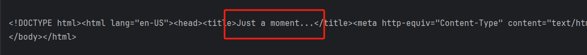
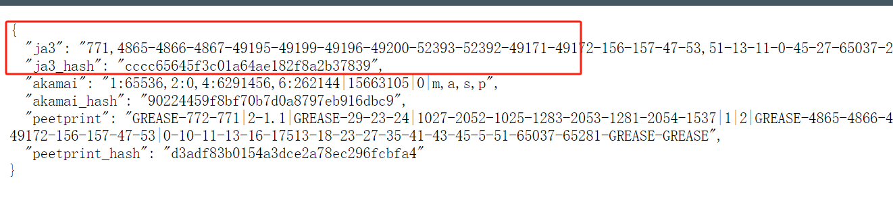
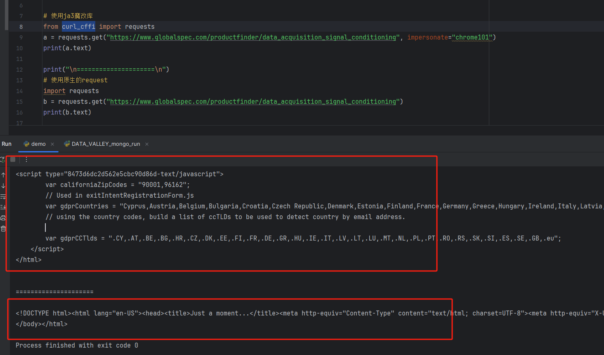

# Ja3解决方案

### Ja3特征：
输出的结果包含 **"Just a moment..."** 字样的基本上就可以肯定是ja3指纹被检测了

### 查看浏览器 Ja3指纹 https://tls.peet.ws/api/clean

## 方案1：
#### 参考文献：https://zhuanlan.zhihu.com/p/601474166
#### 这里使用一个大佬魔改的request库 curl_cffi
    pip install curl_cffi -i https://pypi.tuna.tsinghua.edu.cn/simple
#### 对比一下魔改携带指纹的库与原生的区别：

## 方案2：
#### 第二种方案效率可能会比较低，就是在Linux上部署一个类似浏览器的服务（使用docker安装一个内置的浏览器）

#### 可以参考一下我之前写的一篇博客：https://blog.csdn.net/m0_61720747/article/details/133993502?spm=1001.2014.3001.5502

